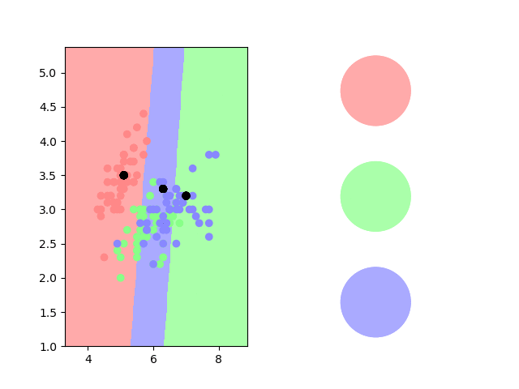
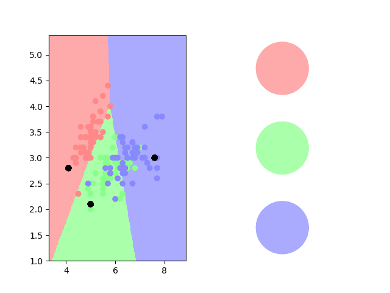
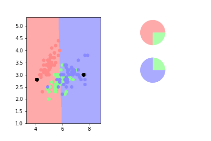

# Soft-Label Dataset Distillation and Text Dataset Distillation

[Paper](https://arxiv.org/abs/1910.02551)


This repo is a fork of the [PyTorch](https://pytorch.org) implementation of [Dataset Distillation](https://ssnl.github.io/dataset_distillation). The original authors distill the knowledge of tens of thousands of images into a few synthetic training images called *distilled images*. We extend their implementation with new features like soft-label dataset distillation and text dataset distillation as described in [Soft-Label Dataset Distillation and Text Dataset Distillation](https://arxiv.org/abs/1910.02551)

(a): On MNIST, 10 soft-label distilled images can train a standard LeNet with a fixed initialization to 96% test accuracy (compared to 99% when fully trained).
On CIFAR10, 100 soft-label distilled images can train a deep network with fixed initialization to 60% test accuracy (compared to 80% when fully trained).

(b): Using soft-label distillation, we can also create distilled datasets that are smaller than the number of classes. On MNIST, just 5 soft-label distilled images can train a standard LeNet with a fixed initialization to 92% test accuracy (compared to 99% when fully trained).

(c): We also increase the space of distillable datasets by enabling text dataset distillation. On IMDB, 20 distilled sentences can train a neural network to 80% test accuracy (compared to 87% when fully trained).


Soft-Label Dataset Distillation and Text Dataset Distillation<br>
[Ilia Sucholutsky](https://ilia10000.github.io/), [Matthias Schonlau](https://www.schonlau.net).<br>
arXiv, 2019.<br>
University of Waterloo

The code in the original repo is written by [Tongzhou Wang](https://ssnl.github.io/) and [Jun-Yan Zhu](https://github.com/junyanz). All changes and new code found in this fork are written by [Ilia Sucholutsky](https://ilia10000.github.io/).

## A k-Nearest Neighbors Analogy for Dataset Distillation

A good way to understand dataset distillation is to first consider the classic k-Nearest Neighbors classification algorithm. When we train a kNN, we essentially divide our space into classes based on the location of points in the training set. However, the cost of training a kNN model increases very quickly with the number of training points. Is it possible to train a kNN to its original accuracy using just a small number of points instead? 

The simplest way to do this would be to select points from the original training set that are somehow most representative of their classes, and then fit the model on those points. This approach has obvious limitations as the resulting classification varies wildly depending on which training points were selected. 
<p align="center"></p>


Another method could be to not limit ourselves to the true training data. Instead, we randomly create some new points, and we move these points around until we find optimal locations for each one (based on training accuracy). This is the basic idea of the what the original dataset distillation algorithm does.
<p align="center"></p>


But if a point is in between two clusters, could it not contain information that describes both classes? It turns out that we can go even further by enabling soft, learnable labels on our synthetic points. 
<p align="center"></p>


By combining learnable labels with learnable locations, we get what is essentially soft-label dataset distillation.
<p align="center"></p>

One of the really exciting and unexpected implications of soft-label dataset distillation, is that we can actually now separate our classes using <b>fewer points than the number of classes</b>. 
<p align="center"></p>

## Prerequisites

### System requirements
- Python 3
- CPU or NVIDIA GPU + CUDA

### Dependencies
- ``torch >= 1.0.0``
- ``torchvision >= 0.2.1``
- ``numpy``
- ``matplotlib``
- ``pyyaml``
- ``tqdm``
- ``torchtext``

You may install `PyTorch` (`torch` package above) using any suggested method for your environment [here](https://pytorch.org/get-started/locally/).

## Using this repo

This fork provides the implementation of the two distillation algorithms described in the paper. Below we describe the basic distillation setting. For other settings and usages, please check out the [Advanced Usage](docs/advanced.md) as well as the [useful scripts](docs/scripts.txt). 

### Getting Started

We aim to encapsulate the knowledge of the entire training dataset, which typically contains thousands to millions of images, into a small number of synthetic training images. To achieve this, we optimize these distilled images such that newly initialized network(s) can achieve high performance on a task, after only applying gradient steps on these distilled images.

The distilled images can be optimized either for a  fixed initialization or random unknown ones from a distribution of initializations.

For soft-label distillation, the label of each distilled image is a vector detailing a distribution of labels that describe that image. We optimize these distilled labels simultaneously with the distilled images themselves.

#### Random unknown initialization

The default options are designed for random initializations. In each training iteration, new initial weights are sampled and trained. Such trained distilled images can be generally applied to unseen initial weights, provided that the weights come from the same initialization distribution.

+ `MNIST`:

    ```sh
    python main.py --mode distill_basic --dataset MNIST --arch LeNet
    ```

+ `Cifar10`:

    ```sh
    python main.py --mode distill_basic --dataset Cifar10 --arch AlexCifarNet \
        --distill_lr 0.001
    ```

    `AlexCifarNet` is an architecture adapted from [the `cuda-convnet` project](https://code.google.com/p/cuda-convnet2/) by Alex Krizhevsky.

#### Fixed known initialization

Alternatively, the distilled images can be optimized for a particular initialization, allowing for high performance using even fewer images (e.g., 10 images with soft labels trains an initialized LeNet to 96% test accuracy).

+ `MNIST`:

    ```sh
    python main.py --mode distill_basic --dataset MNIST --arch LeNet \
        --distill_steps 1 --train_nets_type known_init --n_nets 1 \
        --test_nets_type same_as_train
    ```

+ `Cifar10`:

    ```sh
    python main.py --mode distill_basic --dataset Cifar10 --arch AlexCifarNet \
        --distill_lr 0.001 --train_nets_type known_init --n_nets 1 \
        --test_nets_type same_as_train
    ```
#### Soft-label distillation

To enable learnable labels, use the following argument (0 for learnable, 1 for static).
```
--static_labels 0 
```
Soft labels can be randomly initialized or initialized as one-hot vectors. This is set with the following argument ('' for one-hot (default)).
```
--random_init_labels ''
```
To have fewer distilled images than the number of classes use the following arguments. The second argument is a list specifying the initial labels to use for each class, if random label initialization is disabled. 
```
--num_distill_classes 5 --init_labels 0 1 2 3 4
```
#### Text distillation
When working with text data, some additional arguments need to be specified. Note that visualization currently needs to be disabled (set it to '') when working with text data. 

+ `IMDB`:
```
python3 main.py --mode distill_basic --dataset imdb --arch TextConvNet3 --distill_steps 1 --static_labels 0 --random_init_labels 0 --textdata True --visualize '' --distilled_images_per_class_per_step 10 --distill_epochs 5 --distill_lr 0.01 --decay_epochs 10 --epochs 100 --lr 0.01 --ntoken 5000 --ninp 100 --results_dir text_results/imdb_20by1_unkinit_repl1 --device_id 0
```
+ `SST5`:
```
python main.py --mode distill_basic --dataset sst5 --arch TextConvNet3 --distill_steps 10 --train_nets_type known_init --n_nets 1 --test_nets_type same_as_train --static_labels 0 --random_init_labels 0 --textdata True --visualize '' --distill_epochs 5 --distill_lr 0.01  --decay_epochs 10 --epochs 100 --lr 0.01 --ntoken 5000 --ninp 100 --results_dir text_results/sst_test
```

## Citation

If you find this useful for your research, please cite the following paper.
```
@article{sucholutsky2019softlabel,
    title={Soft-Label Dataset Distillation and Text Dataset Distillation},
    author={Ilia Sucholutsky and Matthias Schonlau},
    journal={arXiv preprint arXiv:1910.02551},
    year={2019}
}
```
You should also cite the original paper that proposed dataset distillation.
```
@article{wang2018dataset,
  title={Dataset Distillation},
  author={Wang, Tongzhou and Zhu, Jun-Yan and Torralba, Antonio and Efros, Alexei A},
  journal={arXiv preprint arXiv:1811.10959},
  year={2018}
}
```


